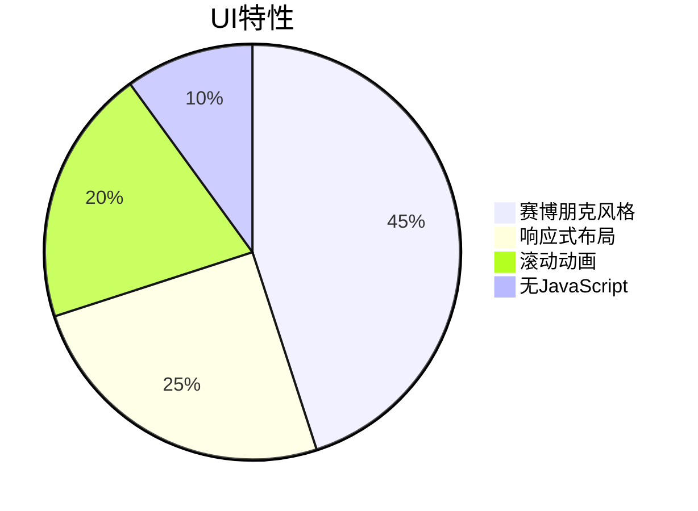

```markdown
# Gr3yPh4ntom 个人主页摘要

## 🧑‍💻 关于我
- 中国高中生，网络安全爱好者
- 技术兴趣：黑客技术/编程/游戏（蔚蓝档案玩家）
- 语言学习：英语→日语（自学中）

## 💻 技术栈
```mermaid
barChart
    title 编程能力
    Python 90
    PHP 70
    HTML/CSS 60
    JavaScript 40
    C# 30
    "C/Java" 20
```

## 🗂️ 主要项目
| 项目 | 描述 | 技术栈 |
|------|------|--------|
| [SYNFlooder](https://github.com/gr3yph/synflooder) | TCP-SYN洪水测试工具 | Python |
| [Wasac](https://github.com/gr3yph/wasac) | Web认证破解工具（BurpSuite替代） | Python |
| [Unix in JS](https://github.com/gr3yph/unix-in-js) | 浏览器UNIX模拟系统 | HTML5/JS |

## 🌐 多语言支持
- 中文/English/日本語 三语切换
- 纯CSS实现无JS交互

## 🎨 设计特点


## 📮 联系方式
`gr3yph4ntom@onionmail.org`  

---
> "The quieter you become, the more you are able to hear."  


